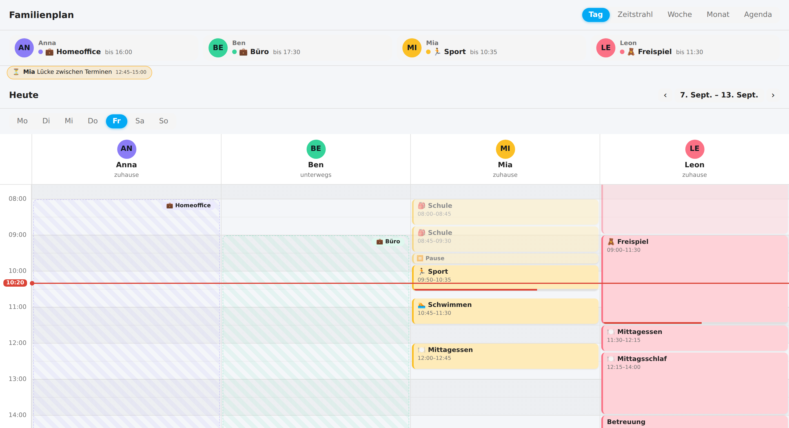

# Family Board Card

**English** · [Deutsch](README.md)



A family calendar — a “who is where, when” board — for [Home Assistant](https://www.home-assistant.io/). People are columns across the top (with the avatar from their `person.*` entity), time runs down the left. The card shows at a glance which activities happen at the same time in different places — for up to 10 people.

- **Day view** – people as columns, a shared time axis, now line; **overlapping events** are placed side by side.
- **Week view** – weekdays as rows, people as columns, compact event chips.
- **Month view** – classic month grid with colored events per person; clicking a day jumps into the day view.
- **Agenda / list view** – chronological list of events grouped by day; ideal on a phone.
- **“Now / next” bar** – optional highlight row above the views: per person, what is running right now (with a pulsing dot) or what is coming next (incl. countdown) – made for the wall tablet.
- **Auto icons** – optionally every event gets a matching emoji by keyword (doctor → 🩺, sport → 🏃, birthday → 🎂, school → 🎒 …); custom rules possible. Titles that already contain an emoji stay untouched.
- **Timeline view** – people as rows on the left, time running horizontally: events as bars on a timeline (Gantt style); overlapping events stack into sub-rows.
- **Pick your views** – choose in the editor which switchers (day/timeline/week/month/agenda) appear.
- **Week navigation** – page back and forth, a click on the date range jumps back to “today”.
- **Theme-aware** – picks up the colors and fonts of the active dashboard theme (uses HA CSS variables throughout).
- **Configurable** – 15/30/60 min grid, day window, weekend on/off, color by person or location, auto refresh.
- **Drag & drop** – in the day view, drag events to move them (time) and drag the bottom edge to change the duration; snaps to the time grid and writes straight back to the calendar – **only** for writable calendars and single events (no series).
- **Manage events** – create/edit/delete right in the card, **but only** for calendars that support it (Local Calendar, CalDAV …). Read-only calendars (e.g. ICS subscriptions) are detected automatically and shown read-only. Recurring events: choose **“this event only / this and following”**.
- **Several calendars per person** – e.g. work + private in one column (selectable in the editor).
- **Robust event logic** – all-day events (exclusive end), events across midnight and multi-day events are split onto the correct days; time zones are respected.
- **Multilingual & localized** – texts in English/German, weekday names and clock format (12/24 h) from the HA locale; relative days (“Today/Tomorrow”).
- **Everyday polish** – past events dimmed, coloring by calendar, open a location straight in the maps app, hide noisy events by pattern.
- **Live progress & countdown** – running events show a progress bar (can be turned off), upcoming ones show “in 20 min” in the agenda; updates every minute.
- **Weather** – icon + temperature per day from a `weather.*` entity in the day/agenda header (HA location, not the event address).
- **Busy days stay readable** – if more events overlap than `max_columns` allows, the extra columns are collapsed into a “+N” chip (click opens the agenda) instead of shrinking into unreadable slivers.
- **Long events as a background band** – long-running events (after-school care, “free play”) beyond a configurable length run as a subtle full-width band behind the column instead of squeezing the short events sideways. The real appointments get the full width.
- **Auto-fit height** – optionally the day view adapts to the available card height so that start–end hour are fully visible without scrolling (ideal for wall tablets / kiosk).
- **Fills the screen** – person columns grow with the card width (panel view / wide cards); with `full_height` the board reaches the bottom of the screen. Column width, axis width and spacing are configurable.
- **Tentative events** – events whose title matches a `tentative_patterns` pattern are drawn dashed and slightly translucent (opt-in; the calendar status is deliberately not evaluated).
- **Entity badges per person** – any entities (phone battery, sensors …) as small chips below the person header; a click opens the more-info dialog.
- **Kiosk mode** – optionally return to the start view and to “today” after X minutes of inactivity; larger touch targets on touch devices.
- **Visual editor 2.0** – no YAML at all: first-run wizard, one-click profiles (🖥️ wall tablet / 📱 phone / 🧩 default), expandable topic groups with helper texts, palette picker per person **and per calendar** (incl. label), fine-tuning sliders (font size, corner radius, opacity) – fields only appear when the matching view is active.
- **⚡ Zero-config start** – when added, the card detects all `person.*` entities and links matching calendars by name; you can re-run it any time via “✨ Detect automatically” in the editor.
- **Person toggle** – clicking a person header hides that person temporarily (the column collapses to the avatar); a second click brings it back. Works in every view.
- **Event clean-up** – allow list (`show_patterns`), title replacement (`replace_patterns`, `"search => replacement"`) and duplicate filter (`filter_duplicates`, the same event in several calendars only once).
- **Multi-day events** – segments show “(2/5)” so it is clear which day of the run this is.
- **Calendar mapping** – with `calendars:` every calendar gets a fixed color, its own label, an **mdi icon** in front of the title and optionally a different **title field**.
- **Title from another field** – school timetable feeds often put the subject into `description` while `summary` only says “Homeroom”: `title_field: description` finally shows “Maths” instead of the same text three times.
- **Free choice of map link** – `map_url` with the `{location}` placeholder (Google Maps, Apple Maps, OpenStreetMap …), the default stays Google Maps.
- **Compact mode** – one switch (`compact`) for smaller fonts and tighter spacing instead of adjusting three sliders.
- **People hidden on start** – `hidden: true` per person; the column starts collapsed and a click on the header brings it back.

> Status: **v0.25 – complete family day planning: 5 views, write access, auto layout (trim/fit/full height), background bands, badges, kiosk mode, mobile optimized, fully localized card *and* editor.**

## Installation (HACS)

The card is part of the official HACS store:

1. Open HACS → search for **Family Board Card** → install.
2. In storage mode the Lovelace resource is registered automatically as `/hacsfiles/ha-family-board-card/ha-family-board-card.js` (in YAML mode add it manually).
3. Add the card to a dashboard: `type: custom:family-board-card` — or simply pick “Family Board Card” in the card picker.

### Manually (quick test without HACS)

Copy `dist/ha-family-board-card.js` to `config/www/` and add it as a resource:

```yaml
url: /local/ha-family-board-card.js
type: module
```

## Configuration

```yaml
type: custom:family-board-card
title: Family board # optional, custom card title
view: day           # day | timeline | week | month | agenda
time_grid: 30       # 15 | 30 | 60
start_hour: 6
end_hour: 22
show_weekends: true
show_now_line: true
color_by: person      # person | location | calendar
hour_height: 64       # pixels per hour (40–96), day view
refresh_interval: 300 # seconds; 0 = off
persons:
  - name: Anna
    person: person.anna     # avatar (entity_picture) + live status
    calendar: calendar.anna # source of the events
    color: '#8B7CF6'        # optional, otherwise the default palette
  - name: Ben
    person: person.ben
    calendar:               # several calendars per person are possible
      - calendar.ben_work
      - calendar.ben_private
```

| Option | Type | Default | Description |
|--------|------|---------|-------------|
| `persons` | list | – | 1–10 people with `name`, `person`, `calendar` (string **or list**), optionally `color`, `badges` (entities as chips) and `hidden` (starts collapsed) |
| `hide_empty_persons` | boolean | `false` | Week view: hide people without events in that week |
| `show_focus` | boolean | `false` | “Now / next” bar per person above the views |
| `drag_drop` | boolean | `true` | Move / resize events in the day view by dragging (writable single events only) |
| `auto_icons` | boolean | `false` | Prepend an emoji per event based on keywords |
| `icon_patterns` | list | – | Custom icon rules, e.g. `["Grandma => 👵"]` |
| `auto_return` | number | `0` | Kiosk: return to the start view / today after X minutes without a touch (0 = off) |
| `title` | string | – | Custom card title (default: localized “Family board”) |
| `view` | string | `day` | Start view: `day`, `timeline`, `week`, `month` or `agenda` |
| `views` | list | all | Which views appear in the switcher, e.g. `[day, agenda]` |
| `time_grid` | number | `30` | Time axis grid in minutes |
| `start_hour` | number | `6` | First visible hour |
| `end_hour` | number | `22` | Last visible hour |
| `show_weekends` | boolean | `true` | Show Sat/Sun |
| `show_now_line` | boolean | `true` | Current time as a line |
| `color_by` | string | `person` | Color by `person`, `location` or `calendar` |
| `dim_past` | boolean | `true` | Dim events that are already over |
| `hide_patterns` | list | – | Hide events whose title contains one of the patterns (e.g. `["Free", "Private"]`) |
| `show_patterns` | list | – | Allow list: only show events whose title contains one of the patterns |
| `replace_patterns` | list | – | Clean up titles: `"search => replacement"` (without `=>` the text is removed) |
| `hide_past` | boolean | `false` | Agenda: skip the days before today so the list starts at today (a week you paged back to still shows everything) |
| `filter_duplicates` | boolean | `false` | Show identical events (title + time) only once per person and in the agenda |
| `calendars` | map | – | Per calendar `color`, `label`, `icon` (mdi) and `title_field` (editable in the editor) |
| `compact` | boolean | `false` | Compact layout: smaller fonts and tighter spacing |
| `map_url` | string | Google | Template for the location link, `{location}` is substituted, e.g. `https://maps.apple.com/?q={location}` |
| `event_size` | number | – | Font size of the event titles in px (editor slider, sets `--fb-event-size`) |
| `radius` | number | – | Corner radius of the event blocks in px (sets `--fb-radius`) |
| `past_opacity` | number | – | Opacity of past events in % (sets `--fb-past-opacity`) |
| `show_progress` | boolean | `true` | Progress bar on the running event |
| `weather_entity` | string | – | `weather.*` entity for the daily forecast (HA location) |
| `show_weather` | boolean | `true`* | Show weather in the header (*only takes effect when `weather_entity` is set) |
| `hour_height` | number | `64` | Height of one hour in px (40–96) – scales the day view (wall tablet); with `fit_height` this is the upper bound |
| `hour_width` | number | `96` | Timeline view: width of one hour in px (48–240) |
| `fit_height` | boolean | `false` | Shrink the day view automatically so that start–end hour are fully visible without scrolling (wall tablet / kiosk) |
| `full_height` | boolean | `false` | Stretch the board to the bottom of the screen (panel / wall tablet view); the default is a 58 % cap |
| `trim_hours` | boolean | `true` | Day view: cut away empty hours at the edges so the busy part of the day gets the full height (min. 6 h window; `start_hour`/`end_hour` stay the outer bounds) |
| `col_min_width` | number | `120` | Minimum width (px) per person column, below that the board scrolls horizontally; above it the columns grow with the card width |
| `background_hours` | number | `3` | Timed events from this length (hrs.) on are drawn as a subtle background band instead of a column; `0` = off |
| `max_columns` | number | `3` | Max. side-by-side columns per person/day; with more overlaps a “+N” chip appears (1–8) |
| `tentative_patterns` | list | – | Mark events with a matching title pattern as tentative (dashed / translucent) |
| `first_day` | string | `monday` | Week starts on `monday` or `sunday` |
| `scroll_to_now` | boolean | `true` | Scroll to “now” on load: the day view to the current time, the timeline horizontally to the now line, the agenda to today's section (or the next day with events when today has none) |
| `refresh_interval` | number | `300` | Auto refresh of the events in seconds (0 = off); additionally when the tablet wakes up |

Every `calendar.*` entity works – no matter whether `local_calendar` (local, no cloud), Google or CalDAV. Home Assistant delivers them all in the same shape.

## Styling (theme / card-mod)

The card picks up the theme's colors and fonts automatically. For fine-tuning there are additional CSS variables you can override in your **theme** or via **card-mod**:

| Token | Default | Effect |
|-------|---------|--------|
| `--fb-accent` | `--primary-color` | “Today” / accent color |
| `--fb-now-color` | `--error-color` | Now line & progress |
| `--fb-radius` | `7px` | Corners of the event blocks |
| `--fb-radius-sm` | `5px` | Corners of the chips |
| `--fb-avatar-size` | `34px` | Avatar size |
| `--fb-past-opacity` | `0.5` | Opacity of past events |
| `--fb-title-size` | `16px` | Card title |
| `--fb-name-size` | `13px` | Person names |
| `--fb-event-size` | `11.5px` | Event titles |
| `--fb-time-size` | `9.5px` | Times inside a block |
| `--fb-chip-size` | `10.5px` | Chip font size |
| `--fb-hourline` / `--fb-halfhour` / `--fb-row-shade` | – | Grid lines / row shading |
| `--fb-col-min` | `120px` | Minimum width of a person column |
| `--fb-axis-width` | `56px` | Width of the time axis on the left |
| `--fb-board-max-height` | `58vh` | Height cap of the day board (without `full_height`) |
| `--fb-event-pad` | `4px 7px` | Inner padding of the event blocks |
| `--fb-head-pad` | `10px 6px` | Inner padding of the person headers |

Example (card-mod):

```yaml
type: custom:family-board-card
card_mod:
  style: |
    :host {
      --fb-accent: #e91e63;
      --fb-event-size: 13px;
      --fb-radius: 12px;
      --fb-avatar-size: 40px;
    }
persons: …
```

## Languages

The card and the visual editor ship with **English and German**. The language follows your Home Assistant user profile; everything not covered by a translation falls back to English. Dates, weekday names and the clock format (12/24 h) come from the HA locale via `Intl`, so they are correct in every language.

Want another language? Add a dictionary to [`src/localize.ts`](src/localize.ts) (card) and [`src/editor-i18n.ts`](src/editor-i18n.ts) (editor) — both are plain key/value objects, pull requests welcome.

## Development

```bash
npm install
npm run build        # builds dist/ha-family-board-card.js
npm run watch        # rebuild on change
npm run lint         # tsc --noEmit (typecheck)
npm test             # Vitest (event logic)
npm run format       # Prettier
```

Fast loop against a running HA instance: copy `dist/ha-family-board-card.js` to `config/www/` and hard-reload the page.

The error-prone event logic (splitting across midnight, all-day exclusivity, time zones, overlap layout) lives isolated in [`src/events.ts`](src/events.ts) and is covered by [`src/events.test.ts`](src/events.test.ts).

## Creating / editing / deleting events

In the day view, clicking an empty spot in a person's column opens the create dialog (the time is taken from the click position); clicking an event opens it for editing/deleting. Whether that is possible depends on the calendar: the card reads `supported_features` of the respective `calendar.*` entity and hides write actions when the calendar does not support them. Internally the WebSocket commands `calendar/event/create|update|delete` are used (the same ones the native HA calendar panel uses).

## Roadmap

- [x] Create/edit/delete events, only for writable calendars
- [x] Person editor in the visual config editor
- [x] Week navigation & side-by-side layout of overlapping events
- [x] i18n (EN/DE) + locale time format
- [x] Kiosk / wall tablet mode (`full_height`, `fit_height`, `auto_return`, touch targets)
- [x] Mobile layout (compact columns, swipeable)
- [x] Drag & drop to move events
- [x] Available in the official HACS store
- [x] Localized visual editor (EN/DE)
- [ ] Location / conflict detection (e.g. “nobody home”, pick-up gaps)

## License

MIT
