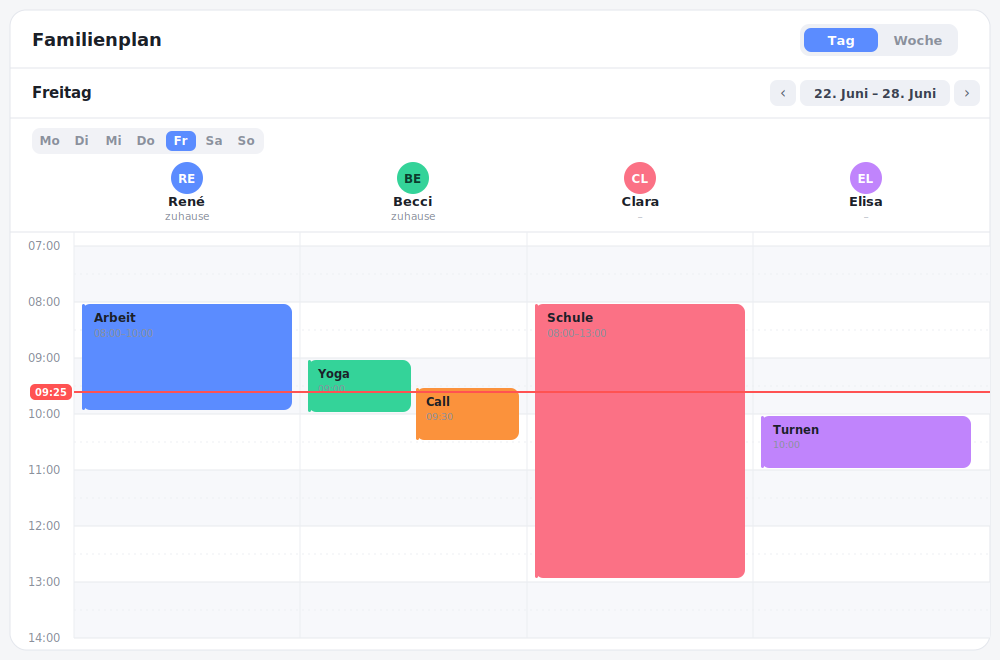

# Family Board Card



Ein Familienkalender bzw. „Wer ist wann wo"-Board für [Home Assistant](https://www.home-assistant.io/). Personen stehen als Spalten oben (mit Avatar aus der `person.*`-Entität), links läuft die Zeitleiste. Die Karte zeigt auf einen Blick, welche Aktivitäten gleichzeitig an unterschiedlichen Orten stattfinden — für bis zu 10 Personen.

- **Tagesansicht** – Personen als Spalten, geteilte Zeitachse, Jetzt-Linie; **überlappende Termine** werden nebeneinander dargestellt.
- **Wochenansicht** – Wochentage als Zeilen, Personen als Spalten, kompakte Termin-Chips.
- **Wochen-Navigation** – vor/zurück blättern, ein Klick auf den Datumsbereich springt zurück zu „heute".
- **Theme-aware** – übernimmt Farben und Schrift des aktiven Dashboard-Themes (nutzt durchgehend HA-CSS-Variablen).
- **Konfigurierbar** – Zeitraster 15/30/60 min, Tagesfenster, Wochenende ein/aus, Einfärben nach Person oder Ort, Auto-Aktualisierung.
- **Termine verwalten** – anlegen/bearbeiten/löschen direkt in der Karte, **aber nur** bei Kalendern, die das unterstützen (Local Calendar, CalDAV …). Schreibgeschützte Kalender (z. B. ICS-Abos) werden automatisch erkannt und nur angezeigt.
- **Robuste Termin-Logik** – Ganztags-Events (Ende exklusiv), über Mitternacht laufende und mehrtägige Termine werden korrekt auf die Tage aufgeteilt; Zeitzonen werden berücksichtigt.
- **Mehrsprachig & lokalisiert** – Texte in Deutsch/Englisch, Wochentage und Uhrzeiten (12/24 h) aus der HA-Locale.
- **Visueller Editor** – Personen inkl. Entity-Auswahl (`person.*`/`calendar.*`) komplett ohne YAML pflegbar.

> Status: **v0.3 – Anzeige + Schreibzugriff + Skalierung/i18n.**

## Installation (HACS, Custom Repository)

Solange die Karte nicht im offiziellen HACS-Store ist:

1. HACS öffnen → oben rechts auf die drei Punkte → **Custom repositories**.
2. URL `https://github.com/renespeaker/ha-family-board-card` eintragen, Typ **Dashboard**, **ADD**.
3. Karte installieren. Die Lovelace-Resource wird im Storage-Mode automatisch als `/hacsfiles/ha-family-board-card/ha-family-board-card.js` registriert (im YAML-Mode manuell eintragen).
4. Karte aufs Dashboard setzen: `type: custom:family-board-card`.

### Manuell (schneller Test ohne HACS)

`dist/ha-family-board-card.js` nach `config/www/` kopieren und als Resource hinzufügen:

```yaml
url: /local/ha-family-board-card.js
type: module
```

## Konfiguration

```yaml
type: custom:family-board-card
title: Familienplan  # optional, eigener Kartentitel
view: day            # day | week
time_grid: 30        # 15 | 30 | 60
start_hour: 6
end_hour: 22
show_weekends: true
show_now_line: true
color_by: person     # person | location
hour_height: 64      # Pixel pro Stunde (40–96), Tagesansicht
refresh_interval: 300 # Sekunden; 0 = aus
persons:
  - name: Anna
    person: person.anna       # Avatar (entity_picture) + Live-Status
    calendar: calendar.anna   # Quelle der Termine
    color: '#8B7CF6'          # optional, sonst Default-Palette
  - name: Ben
    person: person.ben
    calendar: calendar.ben
```

| Option          | Typ     | Default | Beschreibung |
|-----------------|---------|---------|--------------|
| `persons`       | Liste   | –       | 1–10 Personen mit `name`, `person`, `calendar`, optional `color` |
| `title`          | string  | –       | Eigener Kartentitel (Default: lokalisiert „Familienplan") |
| `view`          | string  | `day`   | Startansicht |
| `time_grid`     | number  | `30`    | Raster der Zeitleiste in Minuten |
| `start_hour`    | number  | `6`     | Erste sichtbare Stunde |
| `end_hour`      | number  | `22`    | Letzte sichtbare Stunde |
| `show_weekends` | boolean | `true`  | Sa/So anzeigen |
| `show_now_line` | boolean | `true`  | Aktuelle Uhrzeit als Linie |
| `color_by`      | string  | `person`| Blöcke nach Person oder Ort einfärben |
| `hour_height`   | number  | `64`    | Höhe einer Stunde in px (40–96) – Tagesansicht skalieren (Wandtablet) |
| `first_day`     | string  | `monday`| Wochenstart: `monday` oder `sunday` |
| `scroll_to_now` | boolean | `true`  | Tagesansicht beim Laden automatisch zur aktuellen Uhrzeit scrollen |
| `refresh_interval` | number | `300` | Auto-Aktualisierung der Termine in Sekunden (0 = aus); zusätzlich bei Tablet-Aufwachen |

Jede `calendar.*`-Entität funktioniert – egal ob `local_calendar` (lokal, ohne Cloud), Google oder CalDAV. Home Assistant liefert alle einheitlich.

## Entwicklung

```bash
npm install
npm run build        # baut dist/ha-family-board-card.js
npm run watch        # Rebuild bei Änderungen
npm run lint         # tsc --noEmit (Typecheck)
npm test             # Vitest (Event-Logik)
npm run format       # Prettier
```

Schneller Loop gegen die laufende HA-Instanz: `dist/ha-family-board-card.js` nach `config/www/` kopieren und die Seite hart neu laden.

Die fehleranfällige Event-Logik (Splitting über Mitternacht, Ganztags-Exklusivität, Zeitzonen, Überlappungs-Layout) liegt isoliert in [`src/events.ts`](src/events.ts) und ist über [`src/events.test.ts`](src/events.test.ts) abgedeckt.

## Termine anlegen / bearbeiten / löschen

In der Tagesansicht eine freie Stelle in der Personenspalte anklicken (oder das **＋** im Spaltenkopf) öffnet den Dialog zum Anlegen; ein Klick auf einen Termin öffnet ihn zum Bearbeiten/Löschen. Ob das möglich ist, hängt vom Kalender ab: Die Karte liest `supported_features` der jeweiligen `calendar.*`-Entität und blendet Schreibaktionen aus, wenn der Kalender sie nicht unterstützt. Intern werden die WebSocket-Kommandos `calendar/event/create|update|delete` genutzt (dieselben wie die native HA-Kalenderoberfläche).

## Roadmap

- [x] Termine anlegen/bearbeiten/löschen, nur bei schreibbaren Kalendern
- [x] Personen-Editor im visuellen Config-Editor
- [x] Wochen-Navigation & Nebeneinander-Layout überlappender Termine
- [x] Mehrsprachigkeit (i18n, DE/EN) + Locale-Zeitformat
- [ ] Orts-/Konflikterkennung (z. B. „niemand zuhause", Abhol-Lücken)
- [ ] Kiosk-/Wandtablet-Modus
- [ ] Aufnahme in den offiziellen HACS-Store ([Anleitung](docs/HACS_STORE.md))

## Lizenz

MIT
